# Understanding Thread Behavior: Spring @Async vs Java parallelStream

This project explores why certain asynchronous test cases can get **stuck** in Spring when using `@Async`, but run **smoothly** when using Java's `parallelStream()`.

---

## 🔍 What's the Problem?

### ✅ This test case works fine:
[WaitParallelStreamServiceTest.test_when_2Levels_never_get_Stuck](./src/test/java/org/tnmk/practice/pro02dasyncmoreunderstanding/sample/parallelitems/pro01_wait_parallelstream/WaitParallelStreamServiceTest.java)

### ❌ This test case gets stuck:
[WaitAsyncServiceTest.test_when_2Levels_If_Lv1AndLv2_GreaterThan_CoreSize_Stuck](./src/test/java/org/tnmk/practice/pro02dasyncmoreunderstanding/sample/springasync/pro02_wait_async/WaitAsyncServiceTest.java)

```mermaid
flowchart TD
WaitAsyncService

    %% Level 1 tasks
    subgraph WaitAsyncLv1
        L1_1(task #91; 0 #93;)
        L1_2(task #91; 1 #93;)    
    end
    
    %% Level 2 tasks
    subgraph WaitAsyncLv2
        L2_1_1(task #91; 0.0 #93;)
        L2_1_2(task #91; 0.1 #93;)
        L2_2_1(task #91; 1.0 #93;)
        L2_2_2(task #91; 1.1 #93;)
    end

    %% Thread to Level 1 task binding
    WaitAsyncService -- async --> L1_1
    WaitAsyncService -- async --> L1_2

    %% Level 1 submits Level 2 tasks asynchronously
    L1_1 -- async --> L2_1_1
    L1_1 -- async --> L2_1_2
    L1_2 -- async --> L2_2_1
    L1_2 -- async --> L2_2_2

    %% Deadlock explanation node
    DeadlockNote["⚠️ Deadlock occurs if no thread is free to run Level 2 tasks because all threads are busy."]

    L2_1_1 --> DeadlockNote
```

---

## 🧠 Why It Happens

### Spring `@Async` (gets stuck):

- Uses a **ThreadPoolExecutor** with a fixed number of threads.
- If a Level 1 task (running in a thread) submits Level 2 `@Async` tasks, but all threads are busy with Level 1, Level 2 tasks are queued.
- **Deadlock** happens: Level 1 is waiting for Level 2 to complete, but no threads are free to run Level 2.

### Java `parallelStream()` (works):

- Uses the **ForkJoinPool** with a **work-stealing** algorithm.
- If one thread finishes early, it helps other threads complete their tasks.
- Even when Level 1 spawns Level 2 tasks, idle threads can "steal" and execute them.
- This avoids deadlock.

---

## 🗺 Diagram (Visual Explanation)

> A side-by-side visual of how the thread pools behave:
- Left: Spring `@Async` gets stuck due to thread starvation.
- Right: `parallelStream()` keeps flowing using work-stealing.

> You can generate this image again using ChatGPT with:  
> _“Draw a diagram comparing Spring @Async vs Java parallelStream explaining deadlock and work stealing.”_

---

## 🛠 How to Avoid the Deadlock in Spring

1. **Increase the thread pool size** to handle both Level 1 and Level 2 tasks.
2. **Avoid nesting `@Async` calls** if possible.
3. Use `CompletableFuture` with a custom `ForkJoinPool` if you want work-stealing behavior.
4. Make sure to configure `ThreadPoolTaskExecutor` correctly in your Spring context.

---

## 🔗 Related Code and Files

- [WaitAsyncService.java](https://github.com/khoitnm/practice-threadlocal/blob/master/pro02d-async-more-understanding/src/main/java/org/tnmk/practice/pro02dasyncmoreunderstanding/sample/springasync/pro02_wait_async/WaitAsyncService.java)
- [WaitParallelStreamService.java](https://github.com/khoitnm/practice-threadlocal/blob/master/pro02d-async-more-understanding/src/main/java/org/tnmk/practice/pro02dasyncmoreunderstanding/sample/parallelitems/pro01_wait_parallelstream/WaitParallelStreamService.java)

---

## 🧠 Summary

| Feature                      | Spring `@Async`      | Java `parallelStream()` |
|-----------------------------|----------------------|--------------------------|
| Thread Pool Type            | ThreadPoolExecutor   | ForkJoinPool             |
| Nested async safety         | ❌ Risk of deadlock   | ✅ Work stealing helps   |
| Use case                    | I/O or blocking tasks| CPU-bound parallel work  |
| Custom thread config        | ✅ Yes                | ⚠️ Limited               |

---

## 📚 Further Reading

- [Spring Boot @Async Issue #6429](https://github.com/spring-projects/spring-boot/issues/6429)
- [ForkJoinPool Work Stealing](https://docs.oracle.com/javase/8/docs/api/java/util/concurrent/ForkJoinPool.html)

---

# References 
To understand more details about `ExecutorService`, `ForkJoin`, ThreadDump, etc., please view [REFERENCES.md](REFERENCES.md)
