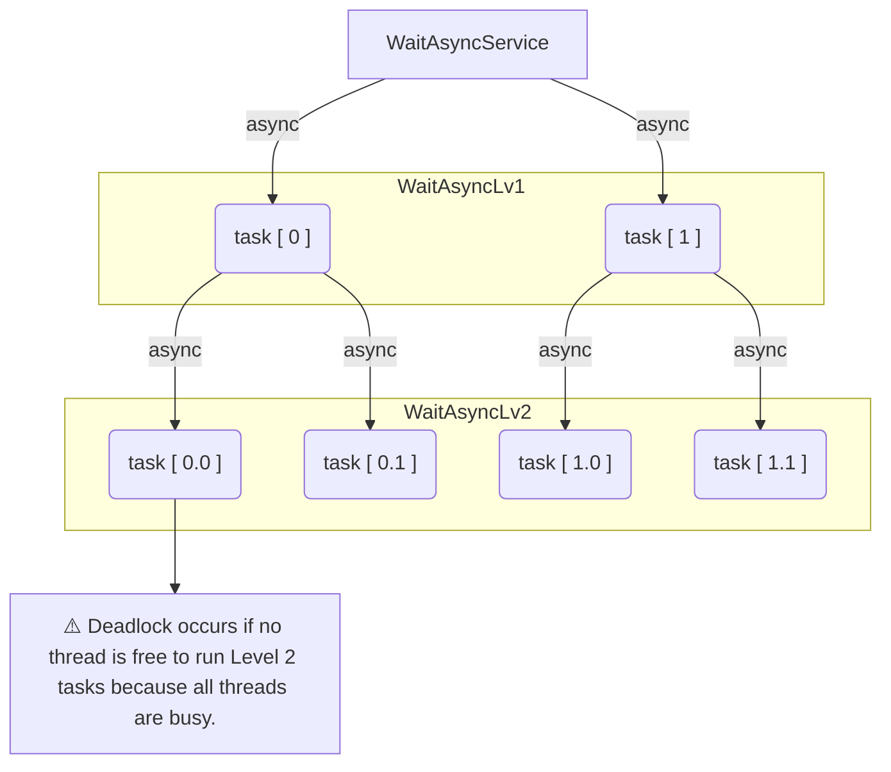

```mermaid
flowchart TD
WaitAsyncService

    %% Level 1 tasks
    subgraph WaitAsyncLv1
        L1_1(task #91; 0 #93;)
        L1_2(task #91; 1 #93;)    
    end
    
    %% Level 2 tasks
    subgraph WaitAsyncLv2
        L2_1_1(task #91; 0.0 #93;)
        L2_1_2(task #91; 0.1 #93;)
        L2_2_1(task #91; 1.0 #93;)
        L2_2_2(task #91; 1.1 #93;)
    end

    %% Thread to Level 1 task binding
    WaitAsyncService -- async --> L1_1
    WaitAsyncService -- async --> L1_2

    %% Level 1 submits Level 2 tasks asynchronously
    L1_1 -- async --> L2_1_1
    L1_1 -- async --> L2_1_2
    L1_2 -- async --> L2_2_1
    L1_2 -- async --> L2_2_2

    %% Deadlock explanation node
    DeadlockNote["⚠️ Deadlock occurs if no thread is free to run Level 2 tasks because all threads are busy."]

    L2_1_1 --> DeadlockNote
```